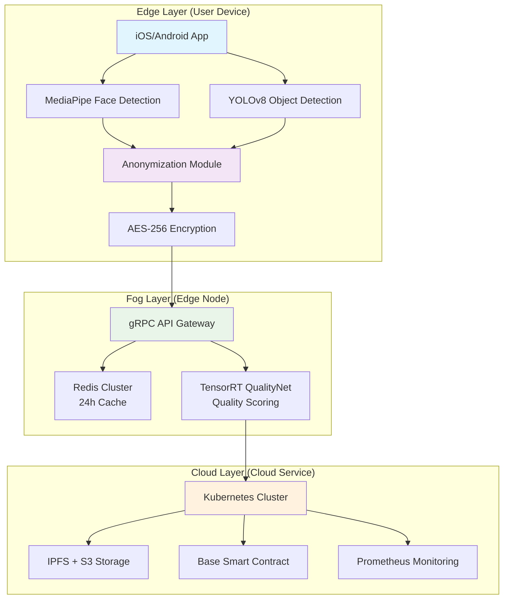
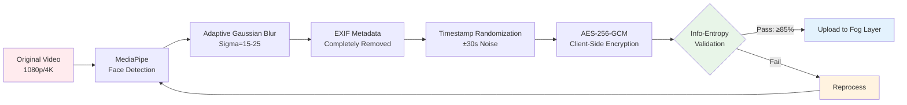
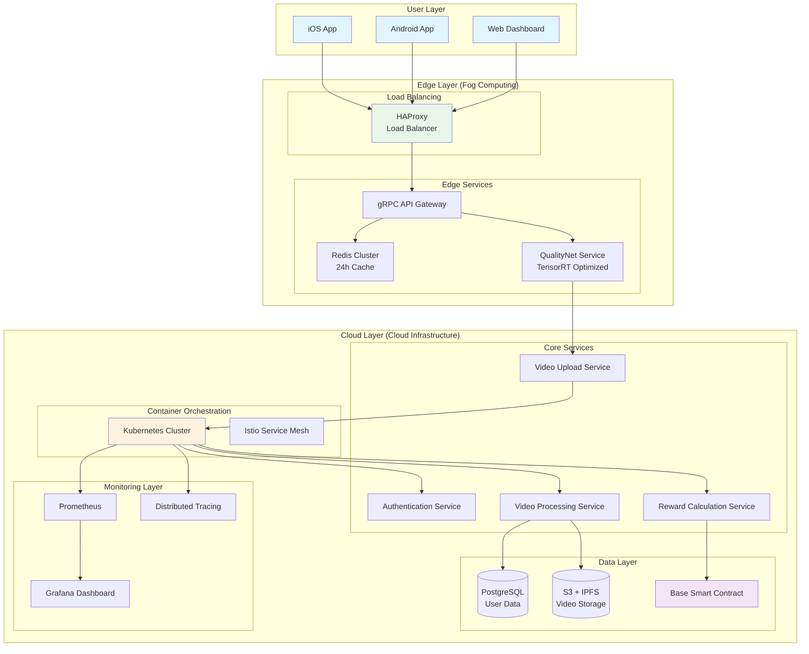
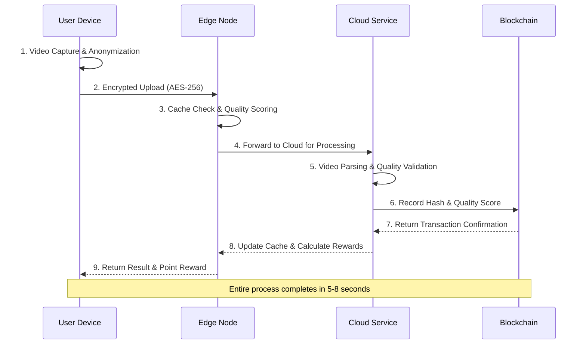
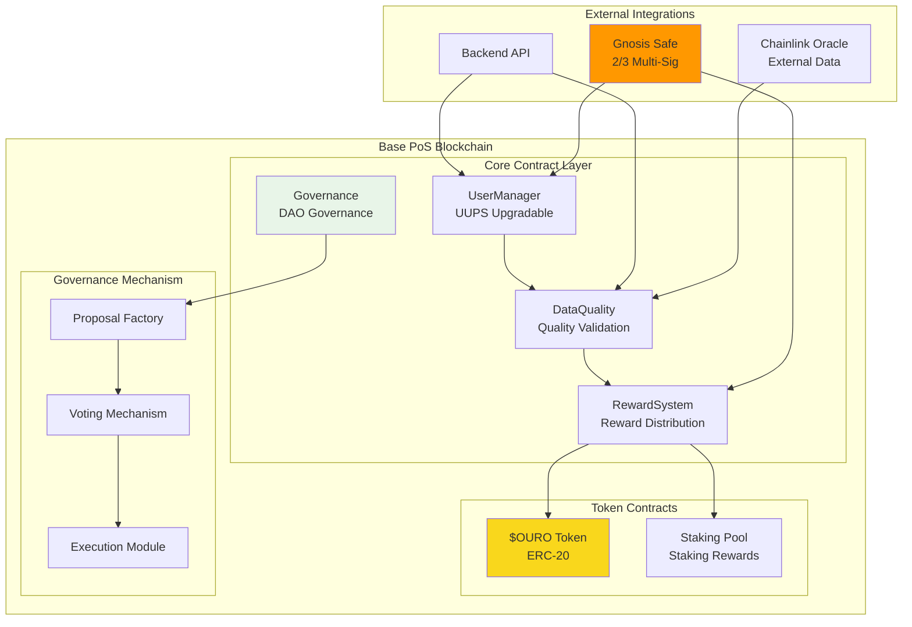
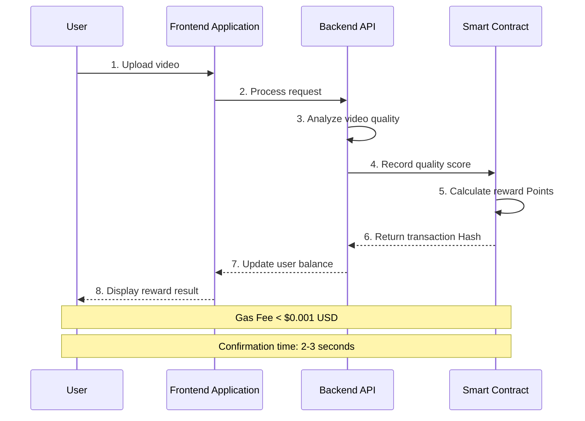
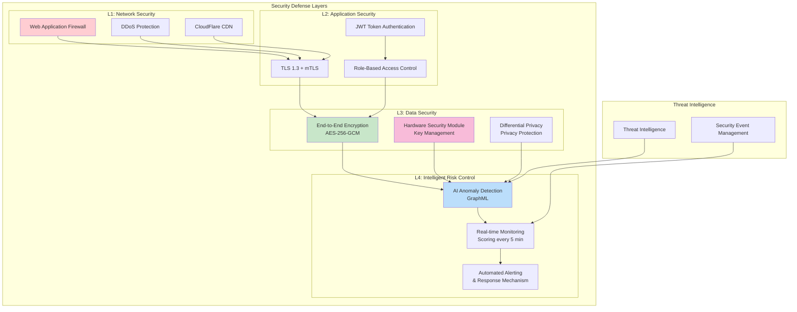
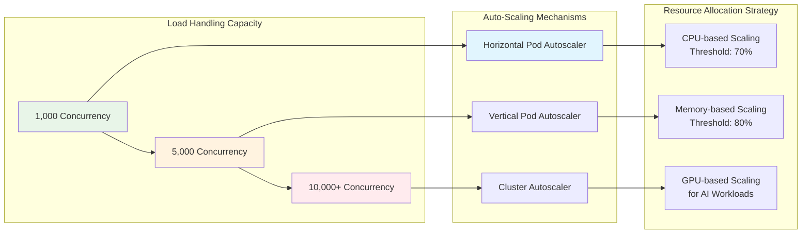
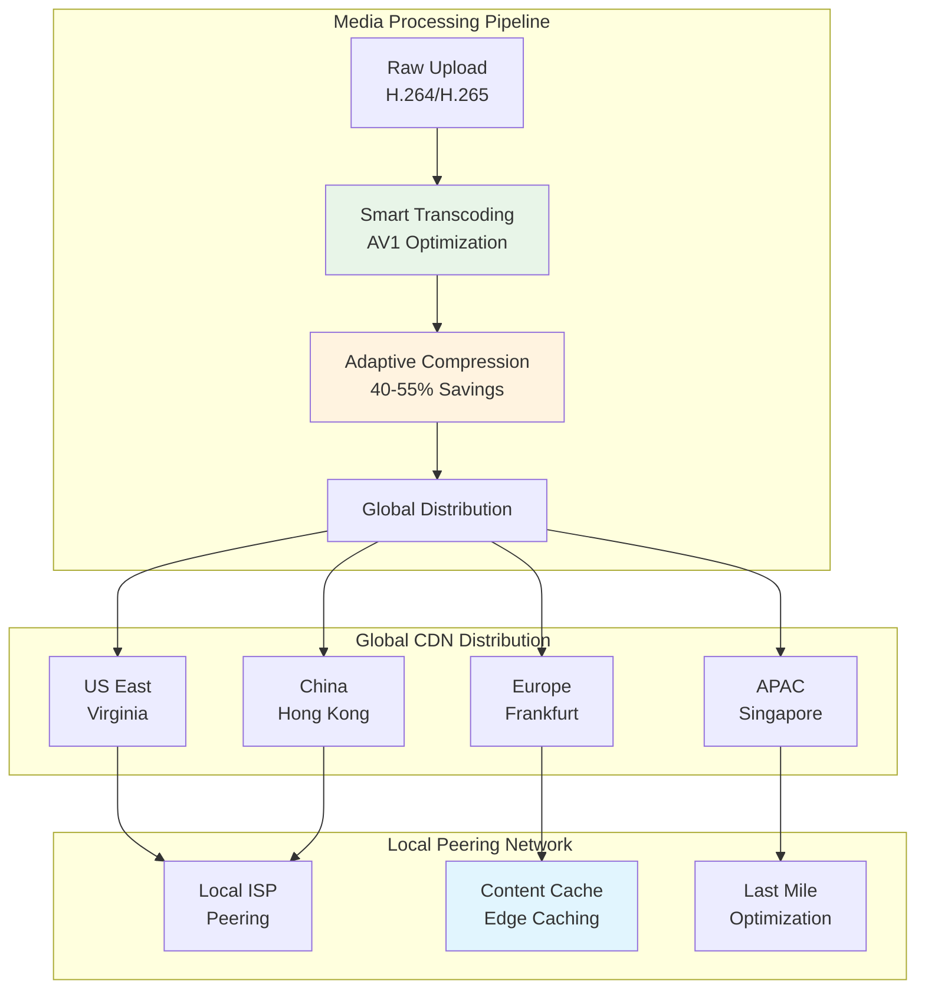

# Chapter 4: Technical Architecture

## 4.1 Core Design Philosophy

### 4.1.1 Privacy-First

OUROBOT adopts "Privacy by Design" principles, making personal data protection the foundation of system architecture.

**Core Strategy:**

* **Edge-side Anonymization**: All personally identifiable information (PII) must be anonymized on user devices
* **Differential Privacy Detection**: Verified through Differential Privacy algorithms to ensure data cannot reverse-identify individuals
* **Minimization Principle**: Only collect the minimum data necessary for service with the shortest retention period

**Technical Implementation:** User Device → Anonymization Processing → Differential Privacy Verification → Edge Nodes/Cloud

### 4.1.2 Edge-First

The platform adopts a distributed three-tier computing architecture, optimizing privacy protection and system performance:

**Edge Layer**

* Real-time inference and anonymization
* MediaPipe + YOLO
* Retain full resolution, avoid sensitive information outflow

**Fog Layer**

* Regional caching and preliminary scoring
* K8s + gRPC
* Reduce latency, distribute computational load

**Cloud Layer**

* Centralized data processing
* Data lake + API + Smart contracts
* Centralized management, scalable processing

**Architecture Advantages:** 🔐 **Privacy Protection**: Sensitive data doesn't leave user devices ⚡ **Low Latency**: Edge computing significantly reduces network transmission 🎯 **High Quality**: Maintain original image resolution for processing

## 4.2 Edge-Side AI Anonymization Technology

### 4.2.1 Face Detection Module

| Specification          | Details                                   |
| ---------------------- | ----------------------------------------- |
| **Core Technology**    | MediaPipe Face Detection (BlazeFace Lite) |
| **Detection Accuracy** | 95% AP @ IoU 0.5                          |
| **Inference Speed**    | 30-40 FPS (Snapdragon 888)                |
| **Model Size**         | < 3 MB                                    |

### 4.2.2 Gesture Tracking Module

**Technical Features:**

* **MediaPipe Hands**: 21 3D Landmarks precise tracking
* **High Precision**: 3D positioning error < 5mm
* **Smoothing Technology**: Kalman filter + Exponential Moving Average (EMA), effectively reduces gesture jitter

### 4.2.3 Object Detection Module

**YOLOv8 Lite Optimized Version:**

* **Model Performance**: mAP@0.5 ≈ 37%
* **Model Size**: Only 6.8 MB after INT8 quantization
* **Application Scenarios**: Identify hand-interactive objects and scene occlusion, assist video quality scoring

### 4.2.4 Multi-layer Anonymization Processing Flow

**Complete Edge-side Anonymization Process:**

**Quality Verification Standards:**

* **Info-Entropy Detection**: Facial region information entropy must decrease ≥85%
* **Anonymization Completeness**: Ensure no reverse identification through multiple verification algorithms
* **Processing Time**: Average 2-5 seconds/minute video (mobile device)

## 4.3 Hybrid Backend System Architecture

### 4.3.1 Complete System Architecture

### 4.3.2 Data Flow Processing Architecture

### 4.3.3 Fog Layer (Edge Computing)

**Core Functions:**

* **Smart Caching**: Redis Cluster 24-hour caching strategy
* **Performance Improvement**: Reduce cloud API calls by 60%
* **Quality Scoring**: TensorRT-optimized QualityNet (ResNet-18)

### 4.3.4 Cloud Layer (Cloud Infrastructure)

**Containerized Platform:**

* **Orchestration System**: Kubernetes + Istio service mesh
* **Auto-scaling**: HPA (Horizontal Pod Autoscaler) based on CPU & GPU utilization
* **Service Discovery**: Automated load balancing and failover

**Data Management:**

* **Storage Solution**: S3-compatible storage + IPFS distributed storage
* **Data Tiering**: Automatic hot/cold data tier management
* **Disaster Recovery**: Cross-region backup and rapid recovery mechanisms

**System Observability:**

* **Monitoring Stack**: Prometheus + Grafana + Jaeger
* **Observability**: 99% system metrics real-time visualization
* **Alert System**: Intelligent anomaly detection and automated response

## 4.4 Blockchain and Smart Contract System

### 4.4.1 Smart Contract Architecture

### 4.4.2 Blockchain Interaction Flow

### 4.4.3 Blockchain Deployment Specifications

| Specification         | Details                     |
| --------------------- | --------------------------- |
| **Main Chain**        | Base One                |
| **Transaction Cost**  | Gas Fee < $0.005 USD USD         |
| **Confirmation Time** | ~2 second finality         |
| **TPS Capacity**      | 1,000+ transactions/second |

### 4.4.4 Security Audit and Governance

**Multi-layer Security Guarantees:**

* **Dual Audit**: Trail of Bits + ConsenSys Diligence
* **Multi-sig Management**: Gnosis Safe (2/3) multi-signature
* **Permission Control**: Contract upgrades and fund pools decided by DAO community

## 4.5 Enterprise-Level Security Protection System

### 4.5.1 Multi-layer Security Architecture

### 4.5.2 End-to-End Encryption

* **Transport Layer**: TLS 1.3 + AES-256-GCM encryption
* **Application Layer**: End-to-end message encryption, zero-trust network architecture
* **Inter-service Communication**: mTLS mutual authentication + RBAC minimum privilege principle

### 4.5.3 Hardware Security Module

* **Trust Root**: HSM (Hardware Security Module) or Intel SGX
* **Key Management**: Distributed key shard storage
* **Hardware Isolation**: Sensitive computations executed in secure hardware environments

### 4.5.4 AI-Driven Risk Control System

* **Behavioral Analysis**: GraphML anomaly detection model
* **Real-time Scoring**: Re-evaluate user risk levels every 5 minutes
* **Adaptive Protection**: Dynamically adjust security policies based on threat levels

## 4.6 High Availability and Performance Optimization

### 4.6.1 System Scalability

### 4.6.2 Network Performance Optimization

**Media Processing Optimization:**

* **Video Encoding**: H.265/AV1 dynamic transcoding
* **Bandwidth Savings**: Average 40-55% transmission bandwidth savings
* **Quality Balance**: Adaptive quality adjustment ensuring optimal user experience

**Global Network Acceleration:**

* **CDN Deployment**: Global POP node coverage
* **Local Peering**: Local Peering technology
* **Latency Optimization**: 60% reduction in download latency for enterprise users

### 4.6.3 System Monitoring and Operations

**DevOps Automation:**

* **CI/CD Pipeline**: Automated testing, deployment, and rollback
* **Blue-Green Deployment**: Zero-downtime updates
* **Disaster Recovery Drills**: Regular disaster recovery testing

## Chapter Summary

OUROBOT's technical architecture combines the latest edge computing, AI technology, blockchain, and enterprise-level security standards to create a privacy-first, high-performance, and scalable decentralized platform.

**Core Technical Advantages:** 🔒 **Privacy Protection**: Edge-side anonymization + differential privacy ensures user data security ⚡ **High Performance**: Three-tier architecture design supports 10,000+ concurrent processing 🌍 **Globalization**: CDN + edge computing reduces latency by 60% 🛡️ **Enterprise-level Security**: Multi-layer protection + AI risk control, 99.9% availability 🏗️ **Scalability**: Kubernetes containerization with automatic horizontal scaling

**Technical Innovation Points:**

* **Privacy-First Design**: All sensitive processing completed on edge devices
* **Edge-Fog-Cloud Hybrid Architecture**: Optimal balance of privacy and performance
* **AI-Driven Quality Scoring**: Automated video quality assessment
* **Blockchain Incentive Mechanism**: Transparent reward distribution
* **Enterprise-level Monitoring System**: Comprehensive system observability and automated operations

Through edge-first design philosophy, we provide excellent technical performance and user experience while protecting user privacy, creating a secure, efficient, and sustainable technical platform for the sign language learning community.
