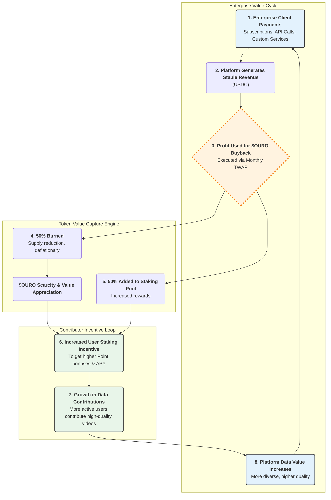

# Chapter 5: Token Economics Model

## 5.1 Token Overview ($OURO)

| Specification                | Details                                                |
| ---------------------------- | ------------------------------------------------------ |
| **Token Standard**           | ERC-20 (Base)                                  |
| **Maximum Supply**           | 1,000,000,000 $OURO (Hard cap, no additional issuance) |
| **Transaction Confirmation** | \~2 second Finality; Gas < $0.005 USD                   |
| **Precision**                | 18 decimals                                            |

### Core Function Positioning

**Value Medium**: Used for Point→Token conversion, platform payments, and staking

**Governance Weight**: 1 $OURO = 1 vote for DAO proposals and voting

**Staking Utility**: Determines membership level acceleration and additional Point bonuses

**Buyback and Burn**: Platform profits regularly buy back and partially burn tokens, forming value loops

## 5.2 Token Distribution and Release

| Allocation Category        | Percentage | Amount (M) | Release Details                                                                                                                  |
| -------------------------- | ---------- | ---------- | -------------------------------------------------------------------------------------------------------------------------------- |
| **Genesis Incentive Pool** | 5%         | 50         | Used for project cold start, linearly released over 12-18 months based on contribution, exclusive rewards for early Contributors |
| **Community Rewards**      | 25%        | 250        | Linearly released over 5 years; used for Contributor rewards                                                                     |
| **Ecosystem Fund**         | 20%        | 200        | DAO managed, supports partnerships and developer grants; 12-month lockup then linear release over 24 months                      |
| **Team & Advisors**        | 15%        | 150        | 12-month lockup; 24-month linear release                                                                                         |
| **Investors**              | 15%        | 150        | 6-month lockup; 18-month linear release                                                                                          |
| **Community Reserve**      | 10%        | 100        | DAO emergency reserve, activated only upon governance approval                                                                   |
| **Liquidity Management**   | 10%        | 100        | Initial DEX & CEX liquidity                                                                                                      |

## 5.3 Incentive Mechanism Design

### 5.3.0 Genesis Phase Incentive Program

To address the core issue of potentially insufficient early contributor incentives during the project's cold start period due to low total platform revenue (S), we have established a "Genesis Phase Incentive Program." This program aims to guarantee returns for early participants and effectively drive the first flywheel of network effects.

**Incentive Source**: Rewards in this phase primarily come from the allocated 5% (50 million $OURO) Genesis Incentive Pool from section 5.2, rather than being directly tied to current platform revenue.

**Operating Mechanism**:

* **Activation Condition**: The program starts immediately upon project launch
* **Reward Calculation**: During the genesis phase, users' Points will be proportionally allocated a fixed amount of $OURO tokens based on their Point generation within the week (or specific cycle). This conversion rate will be significantly higher than the dynamic conversion rate R calculated from minimal platform revenue, ensuring reward attractiveness
* **End and Transition**: The "Genesis Phase" will continue until the platform's Monthly Recurring Revenue (MRR) consistently exceeds $50,000 USDC for three consecutive months, or 12 months from launch (whichever comes first). Once triggered, this incentive program will smoothly transition to the dynamic conversion model driven by platform revenue described in section 5.3.1. The remaining portion of the Genesis Incentive Pool will be transferred to the community treasury, with subsequent use determined by the DAO

### 5.3.1 Point → Token Conversion

**R = (α × S) / (P + ε)**

Where:

* **R**: $OURO convertible per Point
* **α**: Revenue allocation coefficient (default 0.4, adjustable by DAO)
* **S**: Platform net revenue during settlement period (USDC equivalent)
* **P**: Total circulating Points during the same period
* **ε**: Minimal value (1e-6) to avoid division by zero

The dynamic conversion rate balances market price and user returns, avoiding token bubbles caused by fixed exchange rates.

### 5.3.2 Staking Mechanism

**Staking Program Mechanism Design**

| Minimum Stake | Lock Period | Base APR | Point Bonus | Early Unlock Penalty | Target User    |
| ------------- | ----------- | -------- | ----------- | -------------------- | -------------- |
| 1,000         | 30 days     | 3%       | +10%        | 5%                   | New user trial |
| 5,000         | 90 days     | 6%       | +25%        | 10%                  | General users  |
| 20,000        | 180 days    | 12%      | +50%        | 15%                  | Active users   |
| 100,000       | 365 days    | 20%      | +100%       | 25%                  | Core users     |

**Penalties**: Early unlock incurs penalties, automatically transferred to ecosystem fund **Compound Interest**: Returns paid in $OURO, optional auto-reinvestment

### 5.3.3 Buyback and Burn

**Sources**: 30% from enterprise subscriptions, 50% from API fees, 40% from custom services

**Schedule**: Fixed monthly date using 30-day TWAP buyback

**Burn Ratio**: 50% of buyback amount immediately burned; remainder injected into staking pool

**Target**: Maintain annual inflation rate < 2%

## 5.4 Governance Design

### 5.4.1 DAO Structure

**Token Holder Assembly**

* Proposals & Voting
* 1 $OURO = 1 vote; proposals need ≥1% circulating token support

**Governance Committee**

* Emergency decisions, oversight
* Gnosis Safe 5/8 multi-sig

**Technical Committee**

* Contract upgrade review
* 3/5 multi-sig

### 5.4.2 Proposal Process

1. **Draft Submission** (Discourse) → 2. **Technical Review** → 3. **Snapshot Voting** (7 days) → 4. **L1 Execution** (Timelock 48h)

**Approval Threshold**: Voting participation ≥10% circulating tokens, and approval > 50%

**Proposal Types**: Parameter adjustments, fund allocations, contract upgrades, strategic partnerships

## 5.5 Value Capture and Sustainability

### 5.5.1 Revenue Source Diversification

| Revenue Stream           | Percentage | Description                                     |
| ------------------------ | ---------- | ----------------------------------------------- |
| **Data Subscriptions**   | 45%        | API / Data-as-a-Service                         |
| **Custom Services**      | 25%        | White-label deployment, project data collection |
| **API Usage Fees**       | 15%        | Real-time analysis, additional statistics       |
| **Technology Licensing** | 10%        | Anonymization SDK, patent licensing             |
| **Other**                | 5%         | Education, consulting, training                 |

### 5.5.2 Inflation Control

**Fixed Total Supply**: Never increase issuance

**Burn Mechanisms**: 50% of buybacks burned + penalty burns + DAO-decided burns

**Target**: Circulating supply steadily decreases annually, offsetting potential inflation from staking rewards

### 5.5.3 Risks and Mitigation

| Risk Type                  | Risk Description                     | Mitigation Strategy                             |
| -------------------------- | ------------------------------------ | ----------------------------------------------- |
| **Price Volatility**       | Severe secondary market fluctuations | TWAP buyback + stablecoin reserves              |
| **Regulatory Uncertainty** | Token classification, tax risks      | Legal opinions + Utility-focused design         |
| **Liquidity Shortage**     | Low initial trading depth            | LP incentives + professional market making      |
| **Governance Attacks**     | Malicious proposals or sybil attacks | Proposal thresholds + Timelock + multi-sig veto |

## Chapter Summary

OUROBOT's token economics model creates a sustainable value cycle through innovative incentive mechanisms and governance structures. The $OURO token serves as both a utility token for platform operations and a governance token for community decision-making.

**Key Design Principles:**

* **Fair Distribution**: Balanced allocation between community, team, and ecosystem development
* **Sustainable Incentives**: Dynamic Point-to-Token conversion based on platform revenue
* **Value Accrual**: Regular buyback and burn mechanisms driven by platform profits
* **Decentralized Governance**: Progressive transition to community-controlled DAO

**Economic Sustainability:**

* Diversified revenue streams reduce dependence on any single source
* Inflation control mechanisms maintain token value over time
* Staking incentives promote long-term token holding and network security
* Transparent governance ensures community alignment with platform development

The tokenomics model is designed to align the interests of all stakeholders—data contributors, enterprise customers, token holders, and the development team—creating a self-reinforcing ecosystem that grows in value as the platform scales.
